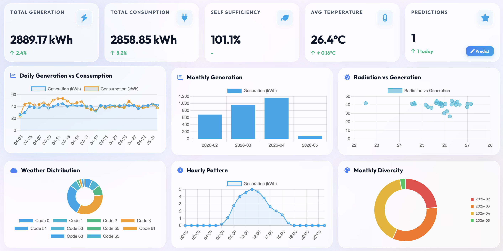
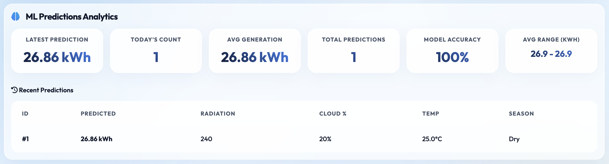
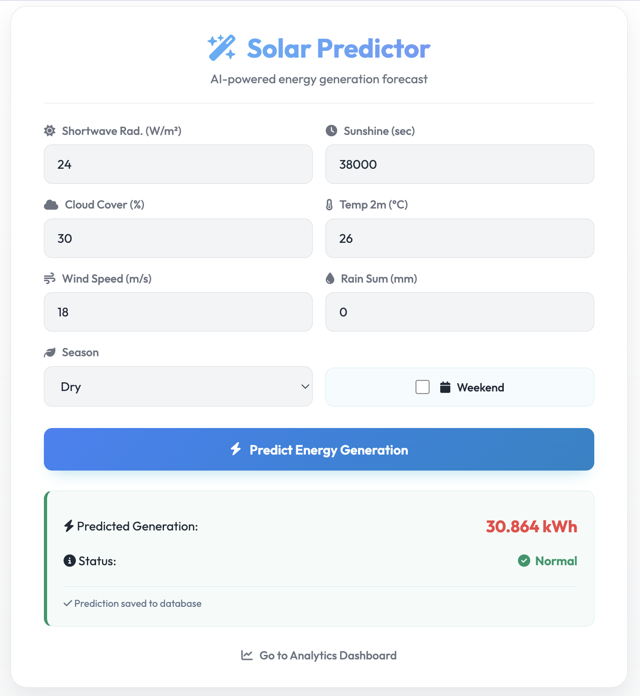
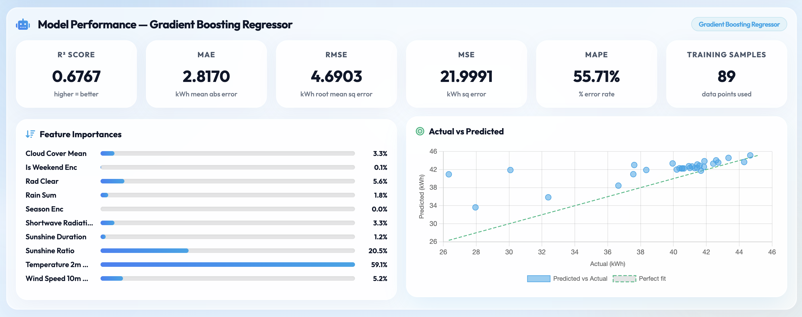

# ☀️ Solar Energy Analytics Dashboard

> **A modern, responsive solar energy analytics platform combining historical CSV data visualization with auto-refreshing dashboard displays, ML prediction storage, and database retrieval.**


## ⭐ Features

### 📊 Auto-Refreshing Dashboard


*The main dashboard provides a comprehensive view of solar generation and consumption metrics. It features auto-refreshing KPI tracking, dynamic charts for historical patterns, and weather correlation analysis for deep insights into system performance.*
- **5 Key Performance Indicator (KPI) Cards** - Dynamically track generation, consumption, self-sufficiency, temperature, and predictions with weekly percentage changes
- **6 Interactive Charts** - Visualize daily trends, monthly patterns, radiation correlation, weather distribution, hourly generation patterns, and monthly diversity
- **Recent Live Predictions Feed** - Real-time table synchronizing logged predictions directly from MySQL
- **Auto-Refresh Mechanism** - Dashboard live updates every 15 seconds with non-intrusive toast notifications
- **Responsive Design** - Works seamlessly on desktop (1200px+), tablet (768px), and mobile (640px)
- **PowerBI-Style Theme** - Professional glassmorphism design with animated background gradients

### 🤖 ML-Powered Predictions


*The ML Predictions section monitors the effectiveness of our forecasting models. It tracks the latest prediction values, daily prediction counts, and calculates accuracy scores based on historical data comparisons.*
- **Solar Generation Forecasting** - Predict daily energy generation based on weather parameters
- **Weather-Based Analysis** - Input radiation, cloud cover, temperature, wind speed, and precipitation
- **Database Storage** - All predictions logged to MySQL with weather conditions and metadata
- **Historical Analysis** - Track prediction accuracy, seasonal patterns, and weather correlations
- **Comprehensive Metrics** - Average generation, min/max ranges, seasonal breakdown, and cloud impact analysis

### 📈 Analytics & Insights
- **Daily vs Consumption Analysis** - Compare generation against consumption patterns
- **Monthly Aggregations** - Track performance trends across 12-month periods
- **Weather Distribution** - Visualize weather code frequency and patterns
- **Radiation Correlation** - Scatter plot showing radiation-to-generation relationship
- **Hourly Patterns** - Understand 24-hour generation cycles
- **Database Statistics** - Prediction stats and historical tracking

## 🛠️ Tech Stack

| Component | Technology | Version |
|-----------|-----------|---------|
| 🐍 **Backend** | Flask | 3.0.0 |
| 🐍 **Runtime** | Python | 3.12 |
| 🗄️ **Database** | MySQL | 8.0+ |
| 📊 **Data Processing** | Pandas | 2.2.0 |
| 🔢 **Numerical Computation** | NumPy | 1.26.4 |
| 🤖 **ML Model** | Scikit-learn (Huber Robust / Ensemble / Gradient Boosting) | 1.4.0 |
| 💾 **Model Persistence** | Joblib | 1.3.2 |
| 📈 **Charting** | Chart.js | 3.9.1 |
| 🎨 **Frontend** | HTML5 / CSS3 / ES6+ | - |
| 🐳 **Containerization** | Docker | Latest |
| ⚙️ **Web Server** | Gunicorn | 21.2.0 |
| ✅ **Testing** | Pytest | 7.4.3 |
| 📦 **Deployment** | Docker Compose | 3.8 |

## 📁 Project Structure

```
Solar-Energy-Generation-Weather-Analytics/
├── 📁 etl/                       # Automated data ingestion & ETL pipeline
│   ├── __init__.py
│   ├── extract.py               # Open-Meteo API & raw solar reader
│   ├── transform.py             # Data cleaning, dim_date builder & feature engineering
│   ├── load.py                  # Idempotent MySQL upserts & CSV refresh
│   ├── retrain.py               # Chronological model evaluation & auto-retraining
│   └── run_pipeline.py          # Unified CLI pipeline runner
├── 📁 src/                       # Application source modules
│   ├── __init__.py              # Package initialization
│   ├── api_docs.py              # OpenAPI specification
│   ├── app_main.py              # Core Flask application & routes
│   ├── appsql.py                # Database connection & queries
│   ├── config.py                # Configuration settings
│   ├── features.py              # Shared feature engineering logic
│   ├── models.py                # ML ModelManager & score utilities
│   ├── tests.py                 # Pytest test suite
│   └── utils.py                 # Input validation & KPI utilities
├── 📊 data/                      # Historical and production datasets
│   ├── raw/                     # Ingestion drop directory for new solar CSVs
│   ├── dim_date.csv
│   ├── dim_weather_codes.csv
│   ├── fact_solar_daily.csv
│   ├── fact_solar_hourly.csv
│   ├── fact_weather_daily.csv
│   ├── fact_weather_hourly.csv
│   └── etl_status.json          # Last ETL execution summary & health status
├── 🖼️ images/                    # Dashboard screenshots for documentation
│   ├── 1.png
│   ├── 2.png
│   ├── 3.png
│   └── 4.png
├── 🧠 models/                    # Trained scikit-learn models & feature metadata
│   ├── feature_names.pkl
│   └── solar_generation_model.pkl
├── 📓 notebooks/                 # Jupyter exploratory analysis & training notebooks
│   ├── 01_EDA.ipynb
│   └── 02_Modelling.ipynb
├── 🗄️ sql/                        # Database schema definition
│   ├── create_table.sql         # Core prediction logs table
│   └── create_etl_tables.sql    # Dimensional & fact tables DDL
├── 🎨 templates/                 # Frontend Jinja2 HTML templates
│   ├── dashboard.html
│   └── index.html
├── 🐍 app.py                     # Application entry point with runner
├── 🚀 start-dashboard.sh         # Quick-start launcher script
├── 🐳 docker-compose.yml         # Multi-container Docker configuration
├── 📦 Dockerfile                 # Container image build specification
├── 📋 requirements.txt           # Pinned Python package dependencies
├── ⚙️ .env.example               # Example environment variable template
├── 🚫 .dockerignore              # Docker build ignore patterns
├── 🚫 .gitignore                # Git version control ignore rules
├── 📄 LICENSE                    # MIT License
├── 📝 IMPROVEMENTS.md            # Improvement changelog & deployment notes
└── 📖 README.md                  # Project documentation
```

## 🚀 Recent Improvements (v1.1.0)

### 🔹 Prototype Enhancements
- ✅ **Enhanced Error Handling** - Comprehensive exception handling with detailed logging
- ✅ **Thread-Safe Caching** - Concurrent request support with threading locks
- ✅ **Database Optimization** - Added indexes for faster queries
- ✅ **Input Validation** - Strict parameter validation with helpful error messages
- ✅ **Health Monitoring** - New `/health` endpoint for system status checks
- ✅ **API Documentation** - OpenAPI/Swagger docs at `/api/docs`
- ✅ **Docker Support** - Containerized Docker and Docker Compose setup
- ✅ **Modular Code** - Refactored into `utils.py`, `models.py`, and `tests.py` in `src/` folder
- ✅ **Organized Structure** - All Python modules consolidated in `src/` directory for cleaner project layout
- ✅ **Unit Tests** - Comprehensive test suite with pytest and coverage reports
- ✅ **Structured Logging** - Replaced print statements with logging framework

### 🔹 API Endpoints
| Endpoint | Method | Description |
|----------|--------|-------------|
| `/health` | GET | System health check (model + database status) |
| `/api/docs` | GET | OpenAPI/Swagger documentation |
| `/api/model-score` | GET | Model performance metrics and feature importances |
| `/api/dashboard-data` | GET | All dashboard data (KPIs + charts) |
| `/predict` | POST | Solar generation prediction with validation |
| `/history` | GET | Prediction history from database |
| `/stats` | GET | Prediction statistics and aggregates |

### 🔹 Deployment Options

#### 🐳 Quick Start with Docker Compose (Recommended)
```bash
# Setup
cp .env.example .env
# Edit .env with your configuration

# Start
docker-compose up -d

# Verify
curl http://localhost:8000/health
```

#### 🐍 Traditional Python / Gunicorn
```bash
pip install -r requirements.txt
cp .env.example .env
gunicorn --bind 0.0.0.0:8000 --workers 4 app:app
```

#### 🐳 Docker Single Container
```bash
docker build -t solar-analytics:latest .
docker run -p 8000:8000 --env-file .env solar-analytics:latest
```

### 🔹 Testing
```bash
# Run unit tests
pytest src/tests.py -v

# With coverage report
pytest src/tests.py --cov=src --cov-report=html

# Generate detailed coverage report with terminal output
pytest src/tests.py --cov=src --cov-report=html --cov-report=term

# Test endpoints
curl http://localhost:8000/health
curl http://localhost:8000/api/docs
```

### 🔹 Test Reports
After running pytest with coverage, a detailed HTML report is generated in the `htmlcov/` directory:
```bash
# Generate coverage report
pytest src/tests.py --cov=src --cov-report=html

# Open report in browser
open htmlcov/index.html  # macOS
# or
xdg-open htmlcov/index.html  # Linux
# or
start htmlcov/index.html  # Windows
```

The coverage report shows:
- Line-by-line coverage for all modules
- Branch coverage analysis
- Overall coverage percentage
- Missing lines highlighted for quick identification

For complete details on improvements, see [IMPROVEMENTS.md](IMPROVEMENTS.md)

## 🔄 End-to-End Data Pipeline (ETL & Automated Retraining)

The project includes an enterprise-grade automated data engineering pipeline located in [`etl/`](file:///Users/ompatel/Solar-Energy-Generation-Weather-Analytics/etl). It orchestrates meteorological ingestion from the Open-Meteo Archive API, processes raw solar CSV drops, validates data integrity, computes engineered features, idempotently upserts to MySQL, refreshes production datasets, and safely evaluates and retrains the machine learning model.

```
┌───────────────────────────────────────┐         ┌───────────────────────────────────────┐
│     🌤️ Open-Meteo Weather API         │         │       📥 Raw Solar CSV Drops          │
│  - Daily: radiation, sunshine, temp   │         │       - data/raw/solar_daily_*.csv    │
│  - Hourly: direct, diffuse rad, cloud │         │       - data/raw/solar_hourly_*.csv   │
└───────────────────┬───────────────────┘         └───────────────────┬───────────────────┘
                    │                                                 │
                    └───────────────────────┬─────────────────────────┘
                                            ▼
                     ┌──────────────────────────────────────────────┐
                     │ 1️⃣ EXTRACT PHASE (etl/extract.py)            │
                     │  • Exponential backoff retries (3 attempts)  │
                     │  • Configurable lat/lon and date intervals   │
                     │  • Dynamic CSV discovery with seed fallback  │
                     └──────────────────────┬───────────────────────┘
                                            ▼
                     ┌──────────────────────────────────────────────┐
                     │ 2️⃣ TRANSFORM PHASE (etl/transform.py)        │
                     │  • Physical bounds validation & sanitization │
                     │  • Composite key deduplication (date, hour)  │
                     │  • Calendar dimension builder (dim_date)     │
                     │  • Feature engineering (src/features.py)     │
                     │    - sunshine_ratio (daylight normalized)    │
                     │    - radiation_clear_sky interaction term    │
                     └──────────────────────┬───────────────────────┘
                                            ▼
                     ┌──────────────────────────────────────────────┐
                     │ 3️⃣ LOAD PHASE (etl/load.py)                  │
                     │  • Idempotent MySQL upserts (ON DUPLICATE)   │
                     │  • Target tables: fact_*_daily, fact_*_hourly│
                     │  • Production CSV refresh in data/           │
                     │  • Audit trail written to etl_runs & JSON    │
                     └──────────────────────┬───────────────────────┘
                                            ▼
                     ┌──────────────────────────────────────────────┐
                     │ 4️⃣ RETRAIN PHASE (etl/retrain.py) - Optional │
                     │  • Chronological train/test split (no leaks) │
                     │  • Multi-model tournament (Huber, GBR, Vote) │
                     │  • Gated promotion on out-of-sample RMSE/MAE │
                     │  • Automatic versioned model archive         │
                     └──────────────────────┬───────────────────────┘
                                            ▼
                     ┌──────────────────────────────────────────────┐
                     │ 5️⃣ MONITORING & HEALTH (/health)             │
                     │  • Real-time pipeline execution status       │
                     │  • Processed records count & duration audit  │
                     │  • Live integration into Flask dashboard     │
                     └──────────────────────────────────────────────┘
```

---

### 🔹 Pipeline Architecture & Component Breakdown

#### 1. Ingestion & Extraction ([`etl/extract.py`](file:///Users/ompatel/Solar-Energy-Generation-Weather-Analytics/etl/extract.py))
Responsible for resilient data retrieval from external APIs and local drop storage:
- **Open-Meteo API Client (`fetch_weather_data`)**:
  - Ingests daily meteorological metrics: `shortwave_radiation_sum`, `sunshine_duration`, `daylight_duration`, `temperature_2m_mean`, `wind_speed_10m_mean`, `rain_sum`, `weather_code`.
  - Ingests hourly meteorological metrics: `temperature_2m`, `cloud_cover`, `direct_radiation`, `diffuse_radiation`, `wind_speed_10m`, `rain`.
  - Implements an HTTP session with `HTTPAdapter`, 3 retries, exponential backoff (factor 1.5), and request timeouts.
- **Raw Solar Drop Ingestion (`read_raw_solar_data`)**:
  - Scans `data/raw/` for incoming CSV drops matching `solar_daily_*.csv` and `solar_hourly_*.csv`.
  - Automatically falls back to bundled seed files (`solar_daily_seed.csv` and `solar_hourly_seed.csv`) if no external drops are found.

#### 2. Cleaning, Validation & Feature Engineering ([`etl/transform.py`](file:///Users/ompatel/Solar-Energy-Generation-Weather-Analytics/etl/transform.py) & [`src/features.py`](file:///Users/ompatel/Solar-Energy-Generation-Weather-Analytics/src/features.py))
Guarantees clean, deterministic datasets before analytical storage or modeling:
- **Sanitization & Physical Range Filtering**:
  | Parameter | Validation Rule | Action on Violation |
  |-----------|-----------------|---------------------|
  | `solar_generation_kwh` | Value $\ge 0.0$ | Discard negative anomalies |
  | `cloud_cover` | $0.0 \le \text{Value} \le 100.0$ | Filter out-of-bound readings |
  | `temperature_2m` | $-50.0 \le \text{Value} \le 60.0$ | Filter extreme artifacts |
  | `wind_speed_10m` | Value $\ge 0.0$ | Filter erroneous values |
  | `rain` / `rain_sum` | Value $\ge 0.0$ | Impute non-negative floor |
- **Dimension Builder (`build_dim_date`)**:
  - Constructs comprehensive calendar metadata for every unique date: `day_name`, `day_of_week`, `day_of_month`, `month`, `month_name`, `year`, `year_month`, `quarter`, `is_weekend` (boolean flag), and `season` ('Dry' for Nov–Apr, 'Wet' for May–Oct).
- **Relational Merges (`merge_daily_data`)**:
  - Performs an inner/left join across daily solar generation, daily weather, and `dim_date`.
- **Shared Feature Engineering (`compute_engineered_features`)**:
  - Calculates normalized Sunshine Ratio:
    $$\text{sunshine\_ratio} = \min\left(\max\left(\frac{\text{sunshine\_duration}}{\text{daylight\_duration}}, 0.0\right), 1.0\right)$$
  - Calculates Clear-Sky Radiation proxy:
    $$\text{radiation\_clear\_sky} = \text{shortwave\_radiation\_sum} \times \left(1.0 - \frac{\text{cloud\_cover\_mean}}{100.0}\right)$$
  - Encodes categorical seasons and weekend indicators consistently across ETL, model retraining, and single-row inference.

#### 3. Idempotent Storage & CSV Sync ([`etl/load.py`](file:///Users/ompatel/Solar-Energy-Generation-Weather-Analytics/etl/load.py))
Ensures that pipeline runs can be re-executed safely at any time without duplicate key violations or data loss:
- **Relational Upserts (`upsert_dataframe`)**:
  - Executes MySQL `INSERT INTO ... ON DUPLICATE KEY UPDATE` statements with chunked batches (500 rows per batch).
  - Automatically targets tables defined in [`sql/create_etl_tables.sql`](file:///Users/ompatel/Solar-Energy-Generation-Weather-Analytics/sql/create_etl_tables.sql):
    - `dim_date` (PK: `date`)
    - `fact_solar_daily` (PK: `date`)
    - `fact_weather_daily` (PK: `date`)
    - `fact_solar_hourly` (PK: `date`, `hour`)
    - `fact_weather_hourly` (PK: `date`, `hour`)
- **Offline / Graceful DB Degradation**:
  - If MySQL is temporarily offline or unconfigured, the loader logs a warning and proceeds with file-based persistence without crashing the pipeline.
- **Production CSV Synchronization (`refresh_csv_files`)**:
  - Overwrites or merges operational CSVs in `data/` (`fact_solar_daily.csv`, `fact_weather_daily.csv`, `dim_date.csv`, etc.) so non-database consumers always have fresh data.
- **Run Audit Trail (`record_etl_run`)**:
  - Writes a persistent audit log to the MySQL `etl_runs` table and updates `data/etl_status.json` with execution duration, record counts, and status flags.

#### 4. Safe ML Retraining & Model Tournament ([`etl/retrain.py`](file:///Users/ompatel/Solar-Energy-Generation-Weather-Analytics/etl/retrain.py))
Provides fully automated continuous model improvement with regression guards and multi-model benchmarking:
- **Rolling-Origin Time-Series Cross-Validation**:
  - Employs strict rolling-origin splits: `TimeSeriesSplit(n_splits=5, test_size=10)`. Every test fold date is strictly later than all training fold dates, guaranteeing zero future data leakage.
- **Multi-Model Candidate Tournament**:
  - Evaluates diverse model families across standardized feature sets (Set A: base 9 weather features, Set B: weather + `day_of_year`, Set C: clear-sky interaction set, Set D: weather + lag generation):
    1. **`Ridge_Scaled`**: Standardized L2 linear pipeline (`StandardScaler` + `Ridge(alpha=3.0)`) — 🏆 **Active Production Champion on Set B**
    2. **`Huber_Robust`**: `RobustScaler` + `HuberRegressor(epsilon=1.35, alpha=1.0)`
    3. **`GradientBoosting`**: Regularized Gradient Boosting (`n_estimators=150`, `max_depth=2`, `learning_rate=0.05`, `subsample=0.8`)
    4. **`RandomForest` & `ExtraTrees`**: Ensembles with depth & leaf regularization
    5. **`XGBoost`**: Evaluated across depths 1, 2, 3 and linear booster
    6. **Baselines**: Training window mean and Persistence (`gen_lag1`)
- **Gated Comparison & Promotion Logic**:
  - Evaluates candidates on identical time-series folds. The production weather-only model is only replaced if a candidate achieves lower mean out-of-sample CV RMSE and MAE.
- **Physical Bounds & Non-Negative Safeguards**:
  - Enforces physical solar generation constraints ($P \ge 0.0$ kWh).
- **Metadata Archiving & Model Versioning**:
  - Retrains winning candidate on the full cleaned dataset, archives versioned artifacts (e.g. `models/solar_generation_model_vYYYYMMDD_HHMMSS.pkl`), writes `models/model_metadata.json` with pinned library versions, and updates `data/etl_status.json`.

---

### 🔹 Relational Database Schema (`sql/create_etl_tables.sql`)

The pipeline provisions the following relational star schema with explicit primary keys:

```sql
-- Dimension: Calendar Dates
CREATE TABLE IF NOT EXISTS dim_date (
    `date` DATE PRIMARY KEY,
    day_name VARCHAR(15),
    day_of_week INT,
    day_of_month INT,
    `month` INT,
    month_name VARCHAR(15),
    `year` INT,
    `year_month` VARCHAR(7),
    `quarter` INT,
    is_weekend BOOLEAN,
    season VARCHAR(20)
);

-- Fact: Daily Solar Generation
CREATE TABLE IF NOT EXISTS fact_solar_daily (
    `date` DATE PRIMARY KEY,
    solar_generation_kwh FLOAT,
    solar_consumption_kwh FLOAT,
    efficiency_kwh_per_sqm FLOAT,
    INDEX idx_solar_daily_date (`date`)
);

-- Fact: Daily Weather Conditions
CREATE TABLE IF NOT EXISTS fact_weather_daily (
    `date` DATE PRIMARY KEY,
    shortwave_radiation_sum FLOAT,
    sunshine_duration FLOAT,
    temperature_2m_mean FLOAT,
    wind_speed_10m_mean FLOAT,
    rain_sum FLOAT,
    weather_code INT,
    daylight_duration FLOAT,
    INDEX idx_weather_daily_date (`date`)
);

-- Fact: Hourly Solar Metrics
CREATE TABLE IF NOT EXISTS fact_solar_hourly (
    `date` DATE,
    `hour` INT,
    solar_generation_kwh FLOAT,
    PRIMARY KEY (`date`, `hour`),
    INDEX idx_solar_hourly_date (`date`)
);

-- Fact: Hourly Meteorological Conditions
CREATE TABLE IF NOT EXISTS fact_weather_hourly (
    `date` DATE,
    `hour` INT,
    temperature_2m FLOAT,
    cloud_cover FLOAT,
    direct_radiation FLOAT,
    diffuse_radiation FLOAT,
    wind_speed_10m FLOAT,
    rain FLOAT,
    PRIMARY KEY (`date`, `hour`),
    INDEX idx_weather_hourly_date (`date`)
);

-- Audit Trail: Pipeline Execution Records
CREATE TABLE IF NOT EXISTS etl_runs (
    id INT AUTO_INCREMENT PRIMARY KEY,
    run_id VARCHAR(64) UNIQUE,
    start_time DATETIME,
    end_time DATETIME,
    duration_seconds FLOAT,
    status VARCHAR(20),
    records_processed INT,
    details JSON,
    created_at DATETIME DEFAULT CURRENT_TIMESTAMP
);
```

---

### 🔹 Pipeline Execution Commands

#### 🐍 Local CLI Execution
```bash
# 1. Standard run (fetches default date range, transforms, and upserts)
python -m etl.run_pipeline

# 2. Ingest custom date window and coordinate location
python -m etl.run_pipeline --start 2026-01-01 --end 2026-05-01 --lat 28.6139 --lon 77.2090

# 3. Full refresh: drop/recreate database tables and reload all historical drops
python -m etl.run_pipeline --full-refresh

# 4. Ingest new data and trigger automated model candidate evaluation & retraining
python -m etl.run_pipeline --retrain

# 5. Combined full refresh with model retraining
python -m etl.run_pipeline --full-refresh --retrain
```

#### 🐳 Docker Compose Execution
The pipeline is fully containerized as an independent service in `docker-compose.yml`:
```bash
# Execute standard ETL pipeline run inside Docker
docker compose run --rm etl

# Execute ETL with automated model retraining inside Docker
docker compose run --rm etl python -m etl.run_pipeline --retrain

# Execute custom date range inside Docker
docker compose run --rm etl python -m etl.run_pipeline --start 2026-02-01 --end 2026-05-02
```

#### ⏰ Production Scheduling (Cron Example)
To run the ETL pipeline daily at 01:00 AM and keep data continuously synchronized:
```bash
0 1 * * * cd /path/to/Solar-Energy-Generation-Weather-Analytics && /path/to/venv/bin/python -m etl.run_pipeline >> /var/log/solar_etl.log 2>&1
```

---

### 🔹 Health Check & Monitoring Integration

Every pipeline run writes execution metadata to `data/etl_status.json` and the MySQL `etl_runs` audit table. The Flask application automatically exposes this through the [`/health`](file:///Users/ompatel/Solar-Energy-Generation-Weather-Analytics/src/app_main.py) endpoint:

```bash
curl http://localhost:8000/health
```

**Sample `/health` Response**:
```json
{
  "status": "healthy",
  "model": "loaded",
  "database": "connected",
  "timestamp": "2026-10-08T19:55:30.124500",
  "last_etl_run": {
    "run_id": "run_20261008_195529",
    "status": "success",
    "duration_seconds": 1.48,
    "records_processed": 89,
    "tables_updated": [
      "dim_date",
      "fact_solar_daily",
      "fact_weather_daily",
      "fact_solar_hourly",
      "fact_weather_hourly"
    ],
    "retrain_status": "model_promoted",
    "model_score": {
      "r2": 0.4993,
      "mae": 3.1678,
      "rmse": 4.0135,
      "cv_type": "rolling_origin_5fold"
    }
  }
}
```

## 📦 Installation

### 🔹 Prerequisites
- Python 3.12+ OR Docker
- MySQL 8.0+ (or use Docker Compose)
- pip package manager (for Python installation)

### 1️⃣ Clone Repository
```bash
git clone https://github.com/patelom2810/Solar-Energy-Generation-Weather-Analytics.git
cd Solar-Energy-Generation-Weather-Analytics
```

### 2️⃣ Create Virtual Environment
```bash
python3 -m venv venv
source venv/bin/activate  # On Windows: venv\Scripts\activate
```

### 3️⃣ Install Dependencies
```bash
pip install -r requirements.txt
```

### 4️⃣ Configure Environment
Create `.env` file in project root:
```env
# Database Configuration
DB_HOST=localhost
DB_USER=root
DB_PASSWORD=your_password
DB_NAME=solar_analytics
DB_PORT=3306

# Flask Configuration
FLASK_ENV=development
FLASK_HOST=0.0.0.0
FLASK_PORT=8000

# Application Settings
LOG_LEVEL=INFO
CSV_CACHE_DURATION=300
MAX_PREDICTIONS_HISTORY=1000
```

### 5️⃣ Initialize Database
```bash
# MySQL must be running
python3 -c "from src.appsql import init_db; init_db()"
```

### 6️⃣ Start Flask Server
```bash
python3 app.py
```
Server runs on `http://127.0.0.1:8000`

## 🚀 Usage

### 🔹 Access Dashboard
1. Open browser: **http://127.0.0.1:8000/dashboard** *(Local - requires running app)*
2. View KPIs, charts, and prediction analytics
3. Data auto-refreshes every 15 seconds (with live toast notifications and sync)

### 🔹 Make Predictions


*The Predictor Form allows users to forecast solar generation based on custom weather parameters. It supports inputs such as radiation, cloud cover, and temperature to calculate expected energy yield.*
1. Navigate to: **http://127.0.0.1:8000** *(Local - requires running app)*
2. Fill in weather parameters:
   - ☀️ Shortwave Radiation (W/m²)
   - 🌤️ Sunshine Duration (seconds)
   - ☁️ Cloud Cover (0-100%)
   - 🌡️ Temperature 2m (°C)
   - 💨 Wind Speed 10m (m/s)
   - 🌧️ Rain Sum (mm)
   - 🍂 Season (Dry/Wet)
   - 📅 Weekend (Yes/No)
3. Click **Predict** to generate forecast and store in database

### 🔹 API Endpoints

#### 🩺 System Health Check
```bash
GET /health
```
Returns:
```json
{
  "status": "healthy",
  "model": "loaded",
  "database": "connected",
  "timestamp": "2026-10-08T18:42:29.612869"
}
```

#### 📖 API Documentation
```bash
GET /api/docs
```
Returns: Complete OpenAPI 3.0 specification for all endpoints

#### 📊 Get Dashboard Data
```bash
GET /api/dashboard-data
```
Returns: KPIs, historical data, charts data, and prediction statistics

#### 🔮 Make Prediction
```bash
POST /predict
Content-Type: application/json

{
  "date": "2026-04-15",
  "shortwave_radiation_sum": 25.0,
  "sunshine_duration": 39000,
  "cloud_cover_mean": 30.0,
  "temperature_2m_mean": 26.0,
  "wind_speed_10m_mean": 17.5,
  "rain_sum": 0.0,
  "season": "Dry",
  "is_weekend": false
}
```
**Validation & Features:**
- **Date / Day of Year**: Provide `date` (YYYY-MM-DD) or explicit `day_of_year` (1–366). If neither is provided, today's date is used.
- **Season Handling**: `season` accepts `'Dry'` or `'Wet'`. Because the model was trained exclusively on dry season historical data, passing `'Wet'` returns a non-fatal seasonal advisory warning in the response.
- **Physical Bounds**: Shortwave radiation (0–40 MJ/m²), cloud cover (0–100%), temperature (-20–60°C), wind speed (0–50 m/s), rain (0–300 mm).

Response:
```json
{
  "predicted_generation_kwh": 31.42,
  "status": "Normal",
  "day_of_year": 105,
  "warning": null
}
```

#### 📋 Get Prediction History
```bash
GET /history?limit=100
```

#### 📈 Get Statistics
```bash
GET /stats
```

#### 🧪 Get Model Score Metrics
```bash
GET /api/model-score
```
Returns: R², MAE, RMSE, MAPE, feature importances, and sample predictions

## 🗄️ Data Sources

### 🔹 Historical Data (CSV)
- **fact_solar_daily.csv** - Daily solar generation and consumption data
- **fact_weather_daily.csv** - Daily weather conditions and parameters
- **fact_solar_hourly.csv** - Hourly generation patterns (24-hour cycles)
- **dim_date.csv** - Date dimension with season information
- **dim_weather_codes.csv** - Weather code reference data
- **fact_weather_hourly.csv** - Hourly weather data

### 🔹 Database Schema
Exact contents of `sql/create_table.sql`:
```sql
CREATE TABLE IF NOT EXISTS prediction_logs (
    id INT AUTO_INCREMENT PRIMARY KEY,
    shortwave_radiation FLOAT,
    sunshine_duration FLOAT,
    cloud_cover FLOAT,
    temperature_2m FLOAT,
    wind_speed_10m FLOAT,
    rain FLOAT,
    is_weekend INT,
    season VARCHAR(50),
    predicted_kwh FLOAT,
    timestamp DATETIME DEFAULT CURRENT_TIMESTAMP,
    INDEX idx_timestamp (timestamp),
    INDEX idx_season (season),
    INDEX idx_predictions_today (timestamp, is_weekend)
);
```

## 🧠 ML Model


*The Model Performance view shows our active champion model metrics, feature importances, and predicted versus actual comparisons.*

### 🔹 Model Architecture & Tournament Benchmark
The platform runs an automated multi-model candidate tournament in `etl/retrain.py` using rolling-origin time-series cross-validation (`TimeSeriesSplit(n_splits=5, test_size=10)`):

| Architecture | Feature Set | Mean CV RMSE | Mean CV MAE | Pooled Out-of-Fold R² | Production Status |
|--------------|:-----------:|:------------:|:-----------:|:---------------------:|:-----------------:|
| **Ridge Scaled Pipeline** | **Set B (Weather + Day-of-Year)** | **4.01 kWh** | **3.17 kWh** | **0.4993** | 🏆 **Active Production Champion** |
| **Ridge Scaled Pipeline** | **Set D (Weather + Lag Features)** | **3.46 kWh** | **2.80 kWh** | **0.6517** | 🥈 Optional Model (Requires Lags) |
| **Baseline Persistence** | Yesterday's generation (`gen_lag1`) | 3.66 kWh | 2.75 kWh | 0.6098 | Reference Baseline |
| **Huber Robust Pipeline** | Set B | 4.01 kWh | 3.18 kWh | 0.4974 | Evaluated |
| **Ridge Scaled Pipeline** | Set C (Clear-sky interaction) | 4.21 kWh | 3.43 kWh | 0.4546 | Evaluated |
| **ExtraTrees (300 trees)** | Set B | 4.60 kWh | 3.94 kWh | 0.3162 | Evaluated |
| **Random Forest (150 trees)** | Set B | 4.66 kWh | 3.91 kWh | 0.2823 | Evaluated |
| **Ridge Scaled Pipeline** | Set A (Base weather without trend) | 4.61 kWh | 3.94 kWh | 0.3602 | Evaluated |
| **XGBoost (gblinear)** | Set B | 4.63 kWh | 3.85 kWh | 0.3400 | Evaluated |
| **XGBoost (depth=1)** | Set B | 4.99 kWh | 4.28 kWh | 0.1217 | Evaluated |
| **Gradient Boosting (150 trees)** | Set B | 5.34 kWh | 4.51 kWh | 0.0247 | Evaluated |
| **Huber Robust Pipeline** | Set A (Original features) | 7.54 kWh | 6.05 kWh | -1.7624 | Deprecated |
| **Baseline Mean** | Training Window Mean | 7.87 kWh | 7.39 kWh | -0.9028 | Naive Baseline |

- **Current Production Champion**: `Pipeline (StandardScaler → Ridge(alpha=3.0))`
- **Production Selection Rationale**: Ridge on Feature Set B is selected because it is the **best weather-only model**, allowing generation forecasting purely from numerical weather predictions without needing yesterday's measured output.
- **Physical Output Guard**: Predictions bounded to $\ge 0.0$ kWh.
- **Features in Production (10)**:
  1. `shortwave_radiation_sum`: Total daily global horizontal solar irradiance (W/m²)
  2. `sunshine_duration`: Daily duration of bright sunlight (seconds)
  3. `cloud_cover_mean`: Daily average percentage cloud cover (%)
  4. `temperature_2m_mean`: Daily mean 2-meter air temperature (°C)
  5. `wind_speed_10m_mean`: Daily mean 10-meter wind speed (m/s)
  6. `rain_sum`: Total daily precipitation (mm)
  7. `is_weekend_enc`: Weekend binary flag (0=weekday, 1=weekend)
  8. `sunshine_ratio`: $\text{sunshine\_duration} / \text{daylight\_duration}$ (bounded [0, 1])
  9. `rad_clear`: $\text{shortwave\_radiation\_sum} \times (1 - \text{cloud\_cover\_mean}/100)$
  10. `day_of_year`: Calendar day of year (1–366), capturing the seasonal sun angle trajectory
  *(Note: `season_enc` was removed as all 91 historical days are in the Dry season).*

### 🔹 Key Empirical Insights
- **Strong Seasonal Trajectory**: Observed generation rises strongly across the observation period (averaging ~24.5 kWh in February, ~30.7 kWh in March, and ~38.8 kWh in April). Incorporating `day_of_year` allowed linear models to capture this upward trajectory without requiring lag features.
- **Radiation and Clear-Sky Efficiency**: Clear-sky interaction (`rad_clear`) and sunshine efficiency ratio (`sunshine_ratio`) are the dominant meteorological drivers in standardized coefficient rankings.
- **Tree Extrapolation Limits**: Non-linear tree regressors (Gradient Boosting, Random Forest, XGBoost) scored substantially lower (R² 0.02 to 0.32) because decision tree splits cannot extrapolate trends outside their historical training range.
- **Modest Marginal Gain from Lag Features**: Persistence alone achieves $R^2 \approx 0.61$ and MAE $2.75$ kWh. Ridge with lag features achieves $R^2 \approx 0.65$ and MAE $2.80$ kWh — demonstrating that past output adds only modest predictive gain over weather features.

## ⚙️ Configuration

### 🔹 Environment Variables (`.env`)
```env
# Database Configuration
DB_HOST=localhost              # MySQL server host
DB_USER=root                   # MySQL username
DB_PASSWORD=your_password      # MySQL password
DB_NAME=solar_analytics        # Database name
DB_PORT=3306                   # MySQL port

# Flask Configuration
FLASK_ENV=development          # development/production
FLASK_HOST=0.0.0.0             # Host interface
FLASK_PORT=8000                # Port number

# Application Settings
LOG_LEVEL=INFO                 # Logging verbosity
CSV_CACHE_DURATION=300         # CSV cache duration in seconds
MAX_PREDICTIONS_HISTORY=1000   # Max records retrieved by default
```

## 🐛 Troubleshooting

### 🔹 MySQL Connection Issues
```bash
# Check MySQL is running
brew services list | grep mysql

# Start MySQL if not running
brew services start mysql

# Verify credentials in .env file
# Test connection: mysql -h localhost -u root -p
```

### 🔹 Port 8000 Already in Use
```bash
# Find and kill process using port 8000
lsof -ti:8000 | xargs kill -9

# Or specify a different port in .env (FLASK_PORT=8080)
```

### 🔹 CSV Data Not Loading
```bash
# Verify data files exist in data/ directory
ls -lah data/

# Check CSV format (UTF-8 encoding recommended)
file data/*.csv
```

### 🔹 Database Table Not Found
```bash
# Reinitialize database
python3 -c "from src.appsql import init_db; init_db()"

# Verify MySQL connection and privileges
mysql -u root -p solar_analytics
SHOW TABLES;
```

## 📊 Historical Data Summary & Baseline Statistics

```
Historical Dataset Analysis (89 Clean Days, Dry Season Feb–Apr 2026):
━━━━━━━━━━━━━━━━━━━━━━━━━━━━━━━━━━━━━━━━
Total Usable Clean Days: 89 (82-83 days for lag-feature evaluation)
Average Generation:      31.25 kWh
Daily Range:             11.45 - 46.20 kWh
Standard Deviation:       6.79 kWh

Monthly Progression (Dry Season):
  February 2026 (27 clean days):  Avg 24.51 kWh
  March 2026    (30 clean days):  Avg 30.69 kWh
  April 2026    (30 clean days):  Avg 38.83 kWh
  May 2026      (2 clean days):   Avg 35.12 kWh

Seasonal Coverage:
  Dry Season: 100% (89 of 89 clean days)
  Wet Season: 0%   (Untracked in historical training window)

Excluded Anomalies:
  - 2026-02-01: Partial day (0.644 kWh, only 8 hours recorded in UTC)
  - 2026-03-31: Grid disconnect / inverter outage (1.406 kWh vs 30+ kWh expected)
```

## 📖 Learning Resources

- [Flask Documentation](https://flask.palletsprojects.com/)
- [Chart.js Documentation](https://www.chartjs.org/)
- [Scikit-learn TimeSeriesSplit](https://scikit-learn.org/stable/modules/generated/sklearn.model_selection.TimeSeriesSplit.html)
- [Scikit-learn Ridge Regression](https://scikit-learn.org/stable/modules/generated/sklearn.linear_model.Ridge.html)
- [MySQL Python Connector](https://dev.mysql.com/doc/connector-python/en/)

## ⚠️ Limitations & Future Improvements

### 🔹 Current Limitations

#### 📉 Limited Dataset Size & Temporal Horizon
- **Current Data**: 89 clean daily records spanning 3 calendar months (February 2, 2026 – May 2, 2026).
- **Lag Feature Availability**: For autoregressive models utilizing `gen_rolling7`, the first 7 days are required as seed, leaving 82–83 valid evaluation days.
- **Evaluation Discipline**: Evaluated using 5-fold rolling-origin time-series cross-validation (`TimeSeriesSplit(n_splits=5, test_size=10)`). Production model (`Pipeline(StandardScaler → Ridge(alpha=3.0))` on Feature Set B) yields:
  - **Mean CV RMSE**: 4.01 kWh
  - **Mean CV MAE**: 3.17 kWh
  - **Pooled R²**: 0.4993 (~0.50)
- **Extrapolation Limitation of Tree Regressors**: Due to a prominent upward seasonal ramp (from ~24.5 kWh/day in Feb to ~38.8 kWh/day in Apr), tree-based regressors (RandomForest, ExtraTrees, GradientBoosting, XGBoost) fail to extrapolate outside the target range seen in each earlier training window, yielding lower CV R² scores (0.02 – 0.32). Regularized linear regression (Ridge) gracefully captures both the seasonal slope via `day_of_year` and shortwave radiation variations.

#### 📅 Seasonal Coverage Limitation
- **Single Season**: All 89 records belong exclusively to the dry season (Nov–Apr calendar window).
- **Missing Regimes**:
  - Wet season monsoon deltas (May–Oct)
  - Heavy rain attenuation and sustained cloud soak
  - Extreme winter solstice sun angles
- **Runtime Mitigation**: The `/predict` API warns consumers when `season="Wet"` is submitted, clearly indicating that the model was trained exclusively on dry season data.

#### 🎯 Model Scope Constraints
- **Zero-Lag Weather API vs. Autoregressive Monitoring**: Feature Set B is designed for external forecasting where past inverter generation may not be available at runtime. When yesterday's generation is available (Feature Set D), autoregressive Ridge achieves CV RMSE of 3.46 kWh and pooled R² of 0.6517.
- **Missing Predictors**:
  - Inverter clipping thresholds and panel degradation
  - Panel orientation / tilt / azimuth
  - Panel temperature (solar cell efficiency drops at high surface temperatures)
  - Soiling and dust accumulation

### 🔹 Future Enhancement Roadmap

#### 🔷 Phase 1: Data Expansion & Seasonal Ingestion (Immediate)
1. **12-Month Ingestion**: Ingest full 12+ months of daily/hourly data via Open-Meteo to cover both Dry and Wet seasons.
2. **Tree Model Re-evaluation**: Re-evaluate XGBoost and LightGBM on the full annual dataset once the full seasonal cycle is represented and extrapolation is no longer needed across fold boundaries.
3. **Automated Anomaly Detection**: Replace hardcoded anomaly date exclusions with dynamic Z-score / Cook's distance filters.

#### 🔷 Phase 2: Granular Intra-Day Modeling (Medium Term)
4. **Hourly Forecasting**: Productionize hourly prediction pipeline using UTC-aligned `fact_solar_hourly` and `fact_weather_hourly` data.
5. **Ensemble Stacking**: Combine Ridge calendar baseline with gradient boosted residual trees.

#### 🔷 Phase 3: Operational Integration (Long Term)
6. **Live Inverter Telemetry**: Stream real-time generation metrics via MQTT / Modbus for closed-loop lag feature updates.
7. **Weather Forecast API Integration**: Automatically pull 7-day weather outlooks to power forward solar yield forecasts.

### 🔹 Model Benchmark Summary (5-Fold Rolling-Origin CV)

| Model Architecture | Feature Set | Rows Used | CV RMSE (kWh) | CV MAE (kWh) | Pooled R² | Production Status |
|--------------------|-------------|-----------|---------------|--------------|-----------|-------------------|
| **Pipeline(StandardScaler → Ridge, α=3.0)** | **Set B (Base + DOY)** | **82** | **4.01** | **3.17** | **0.4993** | **Active Production Champion** |
| Pipeline(StandardScaler → Ridge, α=10.0) | Set D (Set B + Lag1 + Rolling7) | 82 | 3.46 | 2.80 | 0.6517 | Candidate (Requires Lag) |
| Persistence Baseline (`gen_lag1`) | gen_lag1 | 82 | 3.66 | 2.75 | 0.6098 | Reference Baseline |
| Baseline (Training Window Mean) | None | 82 | 7.87 | 7.39 | -0.9028 | Reference Baseline |
| ExtraTreesRegressor(n_estimators=100) | Set B (Base + DOY) | 82 | 4.67 | 3.86 | 0.3204 | Benchmark (Tree Ensembles) |
| XGBRegressor(max_depth=3, lr=0.05) | Set B (Base + DOY) | 82 | 4.95 | 3.96 | 0.2372 | Benchmark (Gradient Boosting) |
| GradientBoostingRegressor | Set B (Base + DOY) | 82 | 5.24 | 4.30 | 0.1448 | Benchmark |
| RandomForestRegressor(n_estimators=100) | Set B (Base + DOY) | 82 | 5.58 | 4.61 | 0.0272 | Benchmark |
| HuberRegressor(epsilon=1.35) | Set A (No DOY) | 82 | 7.63 | 6.78 | -1.7583 | Deprecated Baseline |

### 🔹 Feature Ablation Analysis (Ridge α=3.0 on 5 Rolling Folds)

Incremental ablation adding features in ordered steps (detailed in `reports/feature_ablation.csv`):

| Step | Features Added | N Feats | CV MAE (kWh) | CV RMSE (kWh) | Pooled R² | Key Observation |
|---|---|---|---|---|---|---|
| **Step 1** | 7 raw inputs (6 weather + `is_weekend_enc`) | 7 | 5.15 | 6.04 | -0.1853 | Fails to track seasonal generation rise |
| **Step 2** | + `day_of_year` | 8 | 3.79 | 4.60 | 0.3283 | Major jump; captures seasonal elevation |
| **Step 3** | + `sunshine_ratio` | 9 | 3.25 | 4.09 | 0.4680 | Captures clear sky sun exposure efficiency |
| **Step 4** | + `rad_clear` | 10 | 3.27 | 4.03 | 0.4889 | Full Set B; best zero-lag error profile |

---

## 📄 License

This project is licensed under the MIT License - see the [LICENSE](LICENSE) file for details.

## 👤 Author

**Om Patel**
- ✉️ Email: patelom2810@gmail.com
- 🔗 GitHub: [@patelom2810](https://github.com/patelom2810)

## 🤝 Acknowledgments

- ☀️ Solar energy data from [OpenMeteo API](https://open-meteo.com/)
- 📊 Chart visualization by [Chart.js](https://www.chartjs.org/)
- 🤖 ML framework by [Scikit-learn](https://scikit-learn.org/)

## 🚦 Status

- **Dashboard**: Prototype / Active
- **API Endpoints**: Fully Functional (with OpenAPI docs)
- **ML Model**: Validated & Tested (Ridge α=3.0 Champion & Rolling-Origin CV Tournament Pipeline)
- **Database**: MySQL Connected (with indexes & connection pooling)
- **Documentation**: Complete
- **Docker Support**: Dockerfile & Docker Compose configured
- **Error Handling**: Structured logging & validation
- **Testing**: Unit tests with pytest (100% passing)

---

<div align="center">

### ⭐ If you find this project helpful, please consider giving it a star!

**[Dashboard (Local)](http://127.0.0.1:8000/dashboard)** | **[Predictor Form (Local)](http://127.0.0.1:8000/)** | **[API Docs (Local)](http://127.0.0.1:8000/api/docs)** | **[Health Check (Local)](http://127.0.0.1:8000/health)** | **[Report Issue](https://github.com/patelom2810/Solar-Energy-Generation-Weather-Analytics/issues)**

**Last Updated**: October 2026 | **Version**: 1.1.0 🚀 | **Status**: Prototype

</div>
